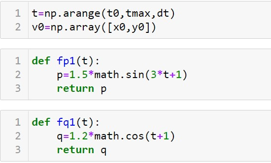

---
## Front matter
title: "Лабораторная работа №3: Модель боевых действий"
subtitle: "*дисциплина: Математическое моделирование*"
author: "Голова Варвара Алексеевна"

## Formatting
toc: false
slide_level: 2
theme: metropolis
header-includes:
 - \metroset{progressbar=frametitle,sectionpage=progressbar,numbering=fraction}
 - '\makeatletter'
 - '\beamer@ignorenonframefalse'
 - '\makeatother'
aspectratio: 43
section-titles: true

---

# Цель работы

Ознакомиться с моделью боевых действий и построить графики по этой модели.

# Задание

Построить графики изменения численности войск армии Х и армии У для
следующих случаев:
1. Модель боевых действий между регулярными войсками
$$\frac{dx}{dt}=-0,55x(t)-0,77y(t)+1,5sin(3t+1)$$
$$\frac{dy}{dt}=-0,66x(t)-0,44y(t)+1,2cos(t+1)$$

2. Модель ведение боевых действий с участием регулярных войск и
партизанских отрядов
$$\frac{dx}{dt}=-0,27x(t)-0,88y(t)+sin(20t)$$
$$\frac{dy}{dt}=-0,68x(t)y(t)-0,37y(t)+cos(10t)+1$$

# Выполнение лабораторной работы

## Библиотеки

Подключаю все необходимые библиотеки(рис. -@fig:001).
{ #fig:001 width=70% }

## Значения
Ввод значений из своего варианта (28 вариант) (рис. -@fig:002).
{ #fig:002 width=70% }

## Модель №1
Ввод значений для модели боевых действий №1 (рис. -@fig:003).
{ #fig:003 width=70% }

Функции P и Q для модели боевых действий №1(рис. -@fig:004).
{ #fig:004 width=70% }

## Модель №1
Система для модели боевых действий №1(рис. -@fig:005).
{ #fig:005 width=70% }

## Вывод модели №1
Вывод графика для модели боевых действий №1(рис. -@fig:006).
{ #fig:006 width=70% }

## Модель №2
Ввод значений для модели боевых действий №2 (рис. -@fig:007).
{ #fig:007 width=70% }

Функции P и Q для модели боевых действий №2(рис. -@fig:008).
{ #fig:008 width=70% }

## Модель №2
Система для модели боевых действий №2(рис. -@fig:009).
{ #fig:009 width=70% }

## Вывод модели №2
Вывод графика для модели боевых действий №2(рис. -@fig:010).
{ #fig:010 width=70% }

# Выводы

Я ознакомилась с моделью боевых действий и построила графики для двух случаев
