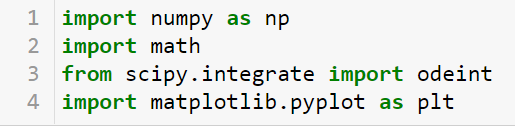
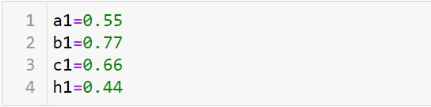
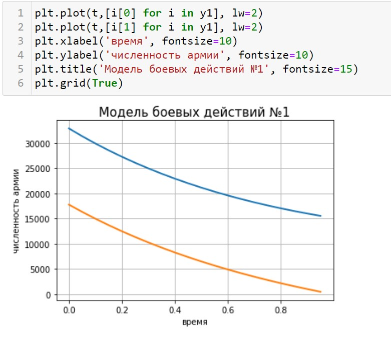
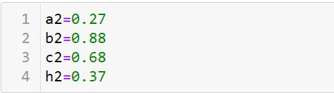
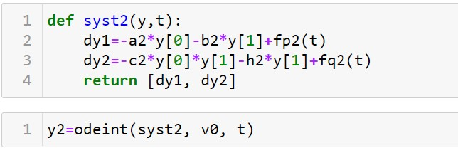
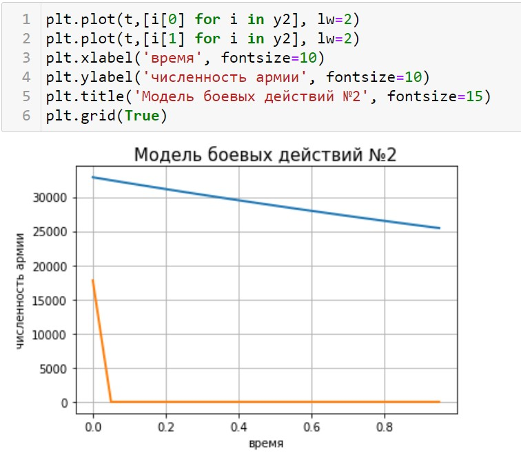

---
# Front matter
lang: ru-RU
title: "Отчет по лабораторной работе №3"
subtitle: "Модель боевых действий"
author: "Голова Варвара Алексеевна"
group: "НФИбд-03-18"
ID: "1032182507"

# Formatting
toc-title: "Содержание"
toc: true # Table of contents
toc_depth: 2
lof: true # List of figures
fontsize: 12pt
linestretch: 1.5
papersize: a4paper
documentclass: scrreprt
polyglossia-lang: russian
polyglossia-otherlangs: english
mainfont: PT Serif
romanfont: PT Serif
sansfont: PT Sans
monofont: PT Mono
mainfontoptions: Ligatures=TeX
romanfontoptions: Ligatures=TeX
sansfontoptions: Ligatures=TeX,Scale=MatchLowercase
monofontoptions: Scale=MatchLowercase
indent: true
pdf-engine: lualatex
header-includes:
  - \linepenalty=10 # the penalty added to the badness of each line within a paragraph (no associated penalty node) Increasing the value makes tex try to have fewer lines in the paragraph.
  - \interlinepenalty=0 # value of the penalty (node) added after each line of a paragraph.
  - \hyphenpenalty=50 # the penalty for line breaking at an automatically inserted hyphen
  - \exhyphenpenalty=50 # the penalty for line breaking at an explicit hyphen
  - \binoppenalty=700 # the penalty for breaking a line at a binary operator
  - \relpenalty=500 # the penalty for breaking a line at a relation
  - \clubpenalty=150 # extra penalty for breaking after first line of a paragraph
  - \widowpenalty=150 # extra penalty for breaking before last line of a paragraph
  - \displaywidowpenalty=50 # extra penalty for breaking before last line before a display math
  - \brokenpenalty=100 # extra penalty for page breaking after a hyphenated line
  - \predisplaypenalty=10000 # penalty for breaking before a display
  - \postdisplaypenalty=0 # penalty for breaking after a display
  - \floatingpenalty = 20000 # penalty for splitting an insertion (can only be split footnote in standard LaTeX)
  - \raggedbottom # or \flushbottom
  - \usepackage{float} # keep figures where there are in the text
  - \floatplacement{figure}{H} # keep figures where there are in the text
---

# Цель работы

Ознакомиться с моделью боевых действий и построить графики по этой модели.

# Задание

Вариант 28

Между страной $X$ и страной $Y$ идет война. Численность состава войск
исчисляется от начала войны, и являются временными функциями
$x(t)$
и
$y(t)$. В
начальный момент времени страна $X$ имеет армию численностью $32$ $888$ человек, а
в распоряжении страны $У$ армия численностью в $17$ $777$ человек. Для упрощения
модели считаем, что коэффициенты
$a,b,c,h$
постоянны. Также считаем
$P(t)$
и
$Q(t)$
непрерывные функции.
Построить графики изменения численности войск армии $Х$ и армии $У$ для
следующих случаев:
1. Модель боевых действий между регулярными войсками
$$\frac{dx}{dt}=-0,55x(t)-0,77y(t)+1,5sin(3t+1)$$
$$\frac{dy}{dt}=-0,66x(t)-0,44y(t)+1,2cos(t+1)$$

2. Модель ведение боевых действий с участием регулярных войск и
партизанских отрядов
$$\frac{dx}{dt}=-0,27x(t)-0,88y(t)+sin(20t)$$
$$\frac{dy}{dt}=-0,68x(t)y(t)-0,37y(t)+cos(10t)+1$$

#Теоретическая справка
Простейшие модели боевых действий - модели Ланчестера. В противоборстве могут принимать участие как регулярные войска,
так и партизанские отряды. В общем случае главной характеристикой соперников
являются численности сторон. Если в какой-то момент времени одна из
численностей обращается в нуль, то данная сторона считается проигравшей (при
условии, что численность другой стороны в данный момент положительна).
Три случая ведения боевых действий:
1. Боевые действия между регулярными войсками
2. Боевые действия с участием регулярных войск и партизанских
отрядов
3. Боевые действия между партизанскими отрядами

В первом случае численность регулярных войск определяется тремя
факторами:
- скорость уменьшения численности войск из-за причин, не связанных с
боевыми действиями (болезни, травмы, дезертирство);
- скорость потерь, обусловленных боевыми действиями
противоборствующих сторон (что связанно с качеством стратегии,
уровнем вооружения, профессионализмом солдат и т.п.);
- скорость поступления подкрепления (задаётся некоторой функцией от времеени)

В этом случае модель боевых действий между регулярными войсками
описывается следующим образом:

$$\frac{dx}{dt}=-a(t)x(t)-b(t)y(t)+P(t)$$
$$\frac{dy}{dt}=-c(t)x(t)-h(t)y(t)+Q(t)$$
Потери, не связанные с боевыми действиями, описывают члены $-a(t)x(t)$ и
$-h(t)y(t)$
, члены $-b(t)y(t)$ и $-c(t)x(t)$ отражают потери на поле боя.
Коэффициенты
$b(t)$ и
$c(t)$ указывают на эффективность боевых действий со
стороны $y$ и $x$ соответственно,
$a(t)$, $h(t)$ - величины, характеризующие степень
влияния различных факторов на потери. Функции $P(t)$, $Q(t)$ учитывают возможность подхода подкрепления к войскам $X$ и $Y$ в течение одного дня.

Во втором случае в борьбу добавляются партизанские отряды. Нерегулярные
войска в отличии от постоянной армии менее уязвимы, так как действуют скрытно,
в этом случае сопернику приходится действовать неизбирательно, по площадям,
занимаемым партизанами. Поэтому считается, что тем потерь партизан,
проводящих свои операции в разных местах на некоторой известной территории,
пропорционален не только численности армейских соединений, но и численности
самих партизан. В результате модель принимает вид:
$$\frac{dx}{dt}=-a(t)x(t)-b(t)y(t)+P(t)$$
$$\frac{dy}{dt}=-c(t)x(t)y(t)-h(t)y(t)+Q(t)$$

Модель ведение боевых действий между партизанскими отрядами с учетом
предположений, сделанном в предыдущем случаем, имеет вид:
$$\frac{dx}{dt}=-a(t)x(t)-b(t)x(t)y(t)+P(t)$$
$$\frac{dy}{dt}=-h(t)y(t)-c(t)x(t)y(t)+Q(t)$$
В простейшей модели борьбы двух противников коэффициенты
$b(t)$ и
$c(t)$
являются постоянными. Попросту говоря, предполагается, что каждый солдат
армии $x$ убивает за единицу времени $c$ солдат армии $y$ (и, соответственно, каждый
солдат армии $y$ убивает $b$ солдат армии $x$). Также не учитываются потери, не
связанные с боевыми действиями, и возможность подхода подкрепления.
Состояние системы описывается точкой $(x,y)$ положительного квадранта плоскости.
Координаты этой точки, $x$ и $y$ - это численности противостоящих армий. Тогда
модель принимает вид
$$\begin{cases}\dot{x}=-by\\\dot{y}=-cx\end{cases}$$
Это - жесткая модель, которая допускает точное решение
$$\frac{dx}{dy}=\frac{by}{cx}$$
$$cxdx=bydy$$
$$cx^2-by^2=C$$
Эволюция численностей армий x и y происходит вдоль гиперболы, заданной
этим уравнением. По какой именно гиперболе пойдет война, зависит от
начальной точки (рис. -@fig:011).
{ #fig:011 width=70% }

Эти гиперболы разделены прямой
$\sqrt{c}x=\sqrt{b}y$
. Если начальная точка лежит
выше этой прямой, то гипербола выходит на ось $y$. Это значит, что в ходе войны
численность армии $x$ уменьшается до нуля (за конечное время). Армия $y$
выигрывает, противник уничтожен.
Если начальная точка лежит ниже, то выигрывает армия $x$. В разделяющем
эти случаи состоянии (на прямой) война заканчивается истреблением обеих армий.
Но на это требуется бесконечно большое время: конфликт продолжает тлеть, когда
оба противника уже обессилены.
Вывод модели таков: для борьбы с вдвое более многочисленным
противником нужно в четыре раза более мощное оружие, с втрое более
многочисленным - в девять раз и т. д. (на это указывают квадратные корни в
уравнении прямой).
Стоит помнить, что эта модель сильно идеализирована и неприменима к
реальной ситуации. Но может использоваться для начального анализа.
Если рассматривать второй случай (война между регулярными войсками и
партизанскими отрядами) с теми же упрощениями, то получим систему:
$$\frac{dx}{dt}=-by(t)$$
$$\frac{dy}{dt}=-cx(t)y(t)$$
Эта система приводится к уравнению
$$\frac{d}{dt}\Big(\frac{b}{2}x^2(t)-cy(t)\Big)=0$$
которое при заданных начальных условиях имеет единственное решение:
$$\frac{b}{2}x^2(t)-cy(t)=\frac{b}{2}x^2(0)-cy(0)=C_1$$
(рис. -@fig:012).
{ #fig:012 width=70% }

Из данного рисунка видно, что при
$C_1>0$
побеждает регулярная армия, при
$C_1<0$
побеждают партизаны. Аналогично противоборству регулярных войск, победа
обеспечивается не только начальной численностью, но и боевой выучкой и
качеством вооружения. При
$C_1>0$
получаем соотношение
$\frac{b}{2}x^2(0)>cy(0)$
. Чтобы
одержать победу партизанам необходимо увеличить коэффициент c и повысить
свою начальную численность на соответствующую величину. Причем это
увеличение, с ростом начальной численности регулярных войск $(x(0))$ , должно
расти не линейно, а пропорционально второй степени
$x(0)$
. Таким образом, можно
сделать вывод, что регулярные войска находятся в более выгодном положении, так
как неравенство для них выполняется прим меньшем росте начальной численности
войск.

# Выполнение лабораторной работы

## Библиотеки

Подключаю все необходимые библиотеки(рис. -@fig:001).
{ #fig:001 width=70% }

## Значения
Ввод значений из своего варианта (28 вариант) (рис. -@fig:002).
{ #fig:002 width=70% }

## Модель №1
Ввод значений для модели боевых действий №1 (рис. -@fig:003).
{ #fig:003 width=70% }

Функции P и Q для модели боевых действий №1(рис. -@fig:004).
{ #fig:004 width=70% }

Система для модели боевых действий №1(рис. -@fig:005).
{ #fig:005 width=70% }

Вывод графика для модели боевых действий №1(рис. -@fig:006).

График изменения численности армии $x$ - синий

График изменения численности армии $y$ - рыжий
{ #fig:006 width=70% }

## Модель №2
Ввод значений для модели боевых действий №2 (рис. -@fig:007).
{ #fig:007 width=70% }

Функции P и Q для модели боевых действий №2(рис. -@fig:008).
{ #fig:008 width=70% }

Система для модели боевых действий №2(рис. -@fig:009).
{ #fig:009 width=70% }

Вывод графика для модели боевых действий №2(рис. -@fig:010).

График изменения численности армии $x$ - синий

График изменения численности армии $y$ - рыжий
{ #fig:010 width=70% }

# Выводы

Я ознакомилась с моделью боевых действий и построила графики для двух случаев
